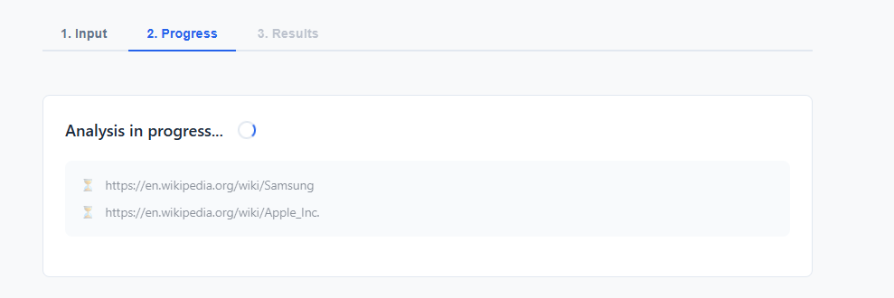
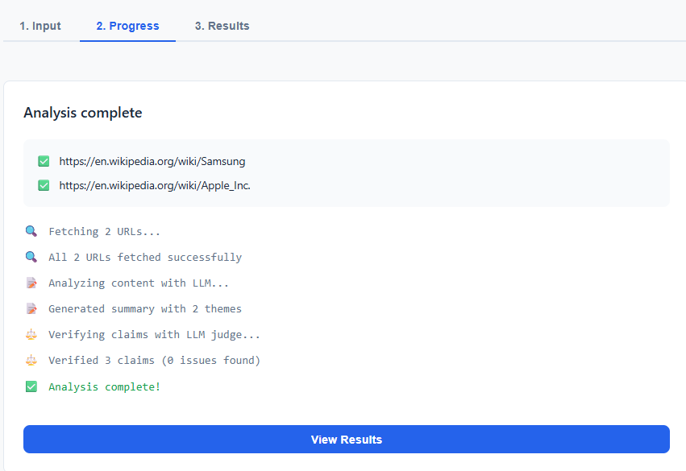
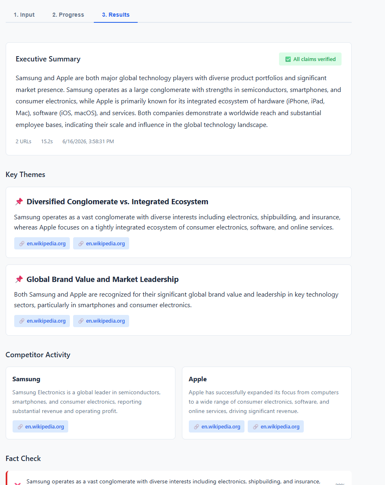
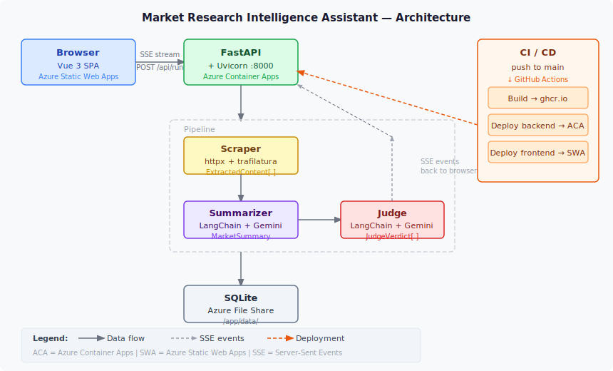

# Market Research Intelligence Assistant

Product and GTM teams spend hours manually tracking competitor blogs, release notes, and
announcements across dozens of sources. This tool automates that: paste in a list of
competitors and up to 5 public URLs, and it scrapes the content, runs it through an LLM
pipeline to extract key themes and competitor activity, then uses a second LLM-as-a-judge
pass to verify each claim against the original source — flagging anything that can't be
grounded in what was actually written.

---

## Table of Contents

- [Live URLs](#live-urls)
- [Demo Account](#demo-account)
- [Screenshots](#screenshots)
- [Architecture](#architecture)
- [Tech Stack](#tech-stack)
- [How This App Was Built](#how-this-app-was-built)
- [Local Setup](#local-setup)
- [Design Decisions](#design-decisions)
- [Free-Tier Constraints and Retry Guidance](#free-tier-constraints-and-retry-guidance)
- [Known Limitations](#known-limitations)
- [Production Improvements](#production-improvements)
- [AI Tools and Models Used](#ai-tools-and-models-used)

---

## Live URLs

| | URL |
|---|---|
| **Frontend** | https://green-river-07505240f.7.azurestaticapps.net |
| **Health check** | https://market-research-api.wonderfulwave-7cb4df30.westus3.azurecontainerapps.io/health |

**API Documentation (Swagger UI):** Available at `/docs` on the backend. The hosted environment may occasionally show styling issues due to external Swagger asset loading restrictions in the production network. The API functionality remains fully operational and unaffected. The complete Swagger experience works locally (see Local Setup below).

---

## Demo Account

The app ships with a single demo user seeded automatically on first startup. No registration needed.

| Field | Value |
|---|---|
| Email | `demo@example.com` |
| Password | `demo1234` |

I deliberately scoped auth to a single seeded demo user — no self-service registration, password
in `.env` — so evaluators can log in immediately without any setup friction. The JWT infrastructure
underneath is production-compatible; extending to full multi-user auth means adding
`POST /auth/register` and removing the seed logic. See ADR-004 for full rationale.

---

## Screenshots

**Live progress — per-URL scrape status streamed in real time**




**Report output — executive summary, trust score, key themes with source badges**



---

## Architecture



```
Browser (Vue 3 SPA)
    │
    │  SSE stream — POST /api/research/run
    ▼
Azure Container Apps — FastAPI + Uvicorn (port 8000)
    │
    ├── Scraper     httpx + trafilatura  →  ExtractedContent[]
    │                  per-URL status streamed live via SSE
    │
    ├── Summarizer  LangChain + Gemini   →  MarketSummary
    │                  (executive summary, key themes, competitor activities)
    │
    └── Judge       LangChain + Gemini   →  JudgeVerdict[]
                       (verifies each claim against original source text)
                    │
                    ▼
             SQLite  ←→  Azure File Share mount (/app/data/)
             (run history scoped to authenticated user)

Hosting
  Frontend  →  Azure Static Web Apps (free tier, global CDN)
  Backend   →  Azure Container Apps, consumption tier (scales to zero)

CI/CD
  push to main  →  GitHub Actions
      ├── Build Docker image  →  push to ghcr.io
      ├── Deploy backend      →  az containerapp update
      └── Deploy frontend     →  azure/static-web-apps-deploy action
```

---

## Tech Stack

| Layer | Technology | Why I chose it |
|---|---|---|
| Frontend | Vue 3 + Vite + Vue Router (3 npm deps) | Kept the bundle lean (~50KB); no UI framework needed for 3 pages |
| Backend | FastAPI + uvicorn | Needed native SSE support and OpenAPI docs; async-first fits the streaming pipeline |
| LLM | Google Gemini 2.5 Flash Lite via LangChain | Free tier (1,500 req/day); composition pattern means I can swap provider via `.env` only (ADR-003) |
| Scraping | trafilatura + httpx | Chose it over BeautifulSoup — ~90% accuracy, zero per-site tuning required (ADR-001) |
| Context passing | Direct (no RAG) | 3–5 URLs fit in the context window; gives the judge exact source text for citation (ADR-002) |
| Auth | JWT + bcrypt, seeded demo user | Avoided OAuth2 overhead for a demo; real JWT infrastructure that extends cleanly (ADR-004) |
| Database | SQLite + SQLAlchemy | Zero infrastructure cost; swapping to Azure SQL requires only changing `DATABASE_URL` |
| Container registry | ghcr.io | Free, vs ~$5/mo for Azure Container Registry — no benefit for a demo (ADR-006) |
| Hosting | Azure Container Apps + Static Web Apps | Both on Azure free/consumption tiers; scales to zero when idle (ADR-006) |

---

## How This App Was Built

### Development approach

The entire project — from initial scaffold to Azure deployment — was built using
**Claude Code CLI** as the primary development environment, with the developer
planning and directing every stage of the work.

The development cycle for each feature followed a consistent pattern:

1. The developer defined the goal, constraints, and success criteria for a phase
2. **Claude Sonnet 4.6** (`claude-sonnet-4-6`) was used in planning sessions to explore
   the codebase, research options, and present alternative approaches with trade-offs
3. The developer reviewed the options and chose the direction — technology choices,
   architecture patterns, scope boundaries
4. Those decisions were captured in Architecture Decision Records (`docs/adr/`) and phase task files (`docs/tasks/`) before any code was written
5. **Claude Haiku 4.5** (`claude-haiku-4-5`) was used for implementation: writing source
   files, editing code, running tests, and fixing bugs under the developer's direction —
   one confirmed step at a time

No step ran autonomously. Every implementation step was announced, reviewed, and
explicitly confirmed before execution.

### Orchestration via CLAUDE.md

`CLAUDE.md` at the repo root is the orchestration layer the developer authored to control
how Claude Code operates across sessions. It enforces:

1. Read `docs/PROGRESS.md` at the start of every session (full context recovery)
2. Find the active task file and the next unchecked step
3. Announce the step and wait for the developer's confirmation before starting
4. After each step: update `docs/PROGRESS.md`, check off the task, stop and report

This kept every session resumable, every decision traceable back to the developer's choice,
and the scope controlled — Claude never moved forward without explicit sign-off.

### Phase structure

| Phase | Scope |
|---|---|
| Phase 0 | Scaffold: pyproject.toml, FastAPI app, Vue SPA, SQLite, .env |
| Phase 1 | Scraping layer: trafilatura + httpx, error handling, tests |
| Phase 2 | LLM pipeline: LLM factory, summarizer, judge, Jinja2 prompts |
| Phase 2.5 | API endpoints: SSE `/api/research/run`, stubs for history/run detail |
| Phase 3 | Vue frontend: all 3 pages, SSE progress, report rendering |
| Phase 4 | Auth + persistence: JWT, demo user seed, SQLite history, router guard |
| Phase 5 | Azure deployment: Dockerfile, docker-compose, CI/CD, live URLs |

Each phase has a task file in `docs/tasks/` with a numbered checklist.
Decisions are logged in `docs/PROGRESS.md` (Decisions section, D-001 through D-009) and
as Architecture Decision Records (ADRs) in `docs/adr/` — short documents that capture what
was decided, what alternatives were considered, and why. ADR-001 through ADR-007 cover every
major architectural choice made during the project.

### Project structure

```
MarketResearch-IntelliAssistant/
├── src/
│   ├── backend/
│   │   ├── main.py              # FastAPI app, CORS middleware, startup init
│   │   ├── config.py            # pydantic-settings: all env vars in one place
│   │   ├── database.py          # SQLAlchemy engine, init_db(), get_session()
│   │   ├── models.py            # User and ResearchRun ORM models
│   │   ├── api/
│   │   │   ├── auth.py          # POST /auth/login, get_current_user() dependency
│   │   │   └── research.py      # SSE /api/research/run, /history, /{id}
│   │   └── pipeline/
│   │       ├── orchestrator.py  # Coordinates scrape → summarize → judge, emits SSE events
│   │       ├── scraper.py       # httpx fetch + trafilatura extract, per-URL SSE events
│   │       ├── summarizer.py    # LangChain chain → MarketSummary (Pydantic)
│   │       ├── judge.py         # LangChain chain → JudgeVerdict[], claim cap + threshold
│   │       ├── llm.py           # get_llm() factory: google / anthropic / openai
│   │       └── prompts/         # Jinja2 templates: summarize.j2, judge.j2
│   └── frontend/
│       ├── src/
│       │   ├── api.ts           # fetch + SSE wrappers, JWT header injection, 401 redirect
│       │   ├── router.ts        # 3 routes (/, /history, /login) + auth guard
│       │   ├── App.vue          # Navbar (reactive to auth state) + RouterView
│       │   ├── style.css        # CSS variables, layout, cards, badges, responsive
│       │   └── pages/
│       │       ├── NewResearch.vue  # Two-column form, SSE progress grid, report render
│       │       ├── History.vue      # Runs table + inline detail view
│       │       └── Login.vue        # Login form → /auth/login → JWT in localStorage
│       ├── vite.config.ts       # Dev proxy /api → localhost:8000, VITE_API_BASE_URL for prod
│       └── staticwebapp.config.json  # Azure SPA routing: all paths → index.html
├── infra/
│   ├── Dockerfile               # Multi-stage python:3.11-slim build, non-root appuser
│   └── docker-compose.yml       # Local full-stack: backend + frontend, data volume
├── docs/
│   ├── PROGRESS.md              # Session log, all decisions (D-001–D-009), phase status
│   ├── adr/                     # ADR-001 through ADR-007 (full architectural rationale)
│   └── tasks/                   # Phase checklists: phase-0-scaffold.md → phase-6-stretch.md
├── tests/
│   └── backend/                 # pytest tests mirroring src/backend/ structure
├── .github/workflows/
│   └── deploy.yml               # CI/CD: Docker build → ghcr.io → ACA update + SWA deploy
├── CLAUDE.md                    # Claude Code orchestration instructions
├── pyproject.toml               # Python project: hatchling build, dep groups, black/ruff/pytest config
└── .env.example                 # All env vars documented with local vs production comments
```

---

## Local Setup

### Prerequisites

- Python 3.11+
- Node 18+
- A Google AI Studio API key — free at https://aistudio.google.com (1,500 req/day on Gemini Flash Lite)

### 1. Clone and configure

```bash
git clone https://github.com/mohan145/MarketResearch-IntelliAssistant.git
cd MarketResearch-IntelliAssistant
cp .env.example .env
```

Edit `.env` — minimum required values:

```dotenv
LLM_PROVIDER=google
LLM_MODEL=gemini-2.5-flash-lite
GOOGLE_API_KEY=<your key>
SECRET_KEY=<any random string, e.g. output of: python -c "import secrets; print(secrets.token_hex(32))">
DEMO_EMAIL=demo@example.com
DEMO_PASSWORD=demo1234
```

### 2. Backend

```bash
pip install -e ".[backend,llm,scraping]"
uvicorn src.backend.main:app --reload --port 8000
```

- API base: `http://localhost:8000`
- Swagger UI: `http://localhost:8000/docs`
- SQLite created automatically at `./data/market_research.db`
- Demo user seeded on first startup

### 3. Frontend

```bash
cd src/frontend
cp .env.example .env      # sets VITE_API_BASE_URL=http://localhost:8000
npm install
npm run dev               # http://localhost:5173
```

The Vite dev server proxies `/api` and `/auth` to the backend, so CORS is not an issue locally.

### 4. Docker Compose (optional)

```bash
docker compose -f infra/docker-compose.yml up --build
```

Runs both services together with the SQLite data volume mounted.

### Full `.env` reference

| Variable | Default | Description |
|---|---|---|
| `LLM_PROVIDER` | `google` | LLM backend: `google`, `anthropic`, or `openai` |
| `LLM_MODEL` | `gemini-2.5-flash-lite` | Model name matching the provider |
| `GOOGLE_API_KEY` | — | Required when `LLM_PROVIDER=google` |
| `ANTHROPIC_API_KEY` | — | Required when `LLM_PROVIDER=anthropic` |
| `OPENAI_API_KEY` | — | Required when `LLM_PROVIDER=openai` |
| `SECRET_KEY` | `change-me-in-production` | JWT signing secret — change for any real deployment |
| `ALGORITHM` | `HS256` | JWT algorithm |
| `ACCESS_TOKEN_EXPIRE_MINUTES` | `1440` | Token lifetime (24 hours) |
| `DEMO_EMAIL` | `demo@example.com` | Seeded demo user email |
| `DEMO_PASSWORD` | `demo1234` | Seeded demo user password |
| `DATABASE_URL` | `sqlite:///./data/market_research.db` | SQLite path (local); use `sqlite:////app/data/...` in container |
| `ALLOWED_ORIGINS` | `http://localhost:5173` | Comma-separated CORS origins |
| `APP_ENV` | `local` | `local` or `production` |
| `LOG_LEVEL` | `INFO` | Uvicorn log level |
| `ENABLE_DOCS` | `true` | Enable Swagger UI at `/docs` |
| `PIPELINE_MAX_ARTICLE_CHARS` | `3000` | Characters of article text passed to summarizer per URL |
| `PIPELINE_MAX_SOURCE_CHARS` | `2000` | Characters of source text passed to each judge call |
| `PIPELINE_MAX_JUDGE_CLAIMS` | `3` | Maximum judge LLM calls per pipeline run |
| `PIPELINE_MAX_THEMES` | `2` | Maximum key themes in summarizer output |
| `PIPELINE_MAX_COMPETITOR_ACTIVITIES` | `2` | Maximum competitor activity cards in output |
| `PIPELINE_HALLUCINATION_THRESHOLD` | `0.8` | Minimum judge confidence (0–1) to flag a claim as a hallucination |

---

## Design Decisions

For each decision I reviewed the options with trade-offs and chose the approach before any code
was written. Full rationale is in `docs/PROGRESS.md` (Decisions D-001–D-009) and the ADR files
in `docs/adr/`. Summaries below.

**ADR-001 — Content Extraction: trafilatura over BeautifulSoup**
I evaluated trafilatura against BeautifulSoup and chose trafilatura. It uses ML heuristics trained
on thousands of sites and achieves ~90% accuracy with a single function call and zero per-site
configuration. BeautifulSoup would have required manual CSS selectors that break on site redesigns
and 10–30x more code to maintain. I added a graceful fallback (raw HTML tag stripping) for the
cases where trafilatura returns nothing.
→ Full rationale: [`docs/adr/ADR-001-content-extraction.md`](docs/adr/ADR-001-content-extraction.md)

**ADR-002 — Direct Context Passing, not RAG**
I chose direct context passing over a RAG architecture. For 3–5 URLs, all extracted text fits
comfortably in the LLM context window (10–50K tokens) — no vector DB needed. The key benefit I
wanted: the judge validates claims against the original source text, not a retrieved snippet, so
citation accuracy is exact. I designed the scraper output contract so a migration to RAG later
would not break the API.
→ Full rationale: [`docs/adr/ADR-002-scraping-architecture.md`](docs/adr/ADR-002-scraping-architecture.md)

**ADR-003 — LLM Composition Pattern via LangChain**
I designed the LLM layer around LangChain's composition pattern: a `get_llm(provider)` factory
returns a `BaseChatModel`, and both the summarizer and judge use `prompt | llm | parser` chains.
My goal was to swap providers by changing only `LLM_PROVIDER` and `LLM_MODEL` in `.env` — zero
code changes. I also moved all prompts into Jinja2 templates so they can be versioned and tuned
independently of the application code.
→ Full rationale: [`docs/adr/ADR-003-llm-composition.md`](docs/adr/ADR-003-llm-composition.md)

**ADR-004 — FastAPI JWT with a Seeded Demo User**
I evaluated OAuth2 (Azure AD, Google, Supabase Auth) and full self-service registration, and
rejected both for this stage — tenant setup, callback URLs, and refresh token flows would add
days for a 1–2 evaluator audience. I chose to seed a single demo user idempotently on startup
with real JWT infrastructure (`python-jose` + direct `bcrypt`). One specific constraint I
resolved: EventSource in the browser cannot set custom headers, so the SSE endpoint accepts the
token via `?token=` query param instead.
→ Full rationale: [`docs/adr/ADR-004-auth-strategy.md`](docs/adr/ADR-004-auth-strategy.md)

**ADR-005 — Pipeline Performance Tuning via Payload Caps**
The pipeline was taking ~3 minutes per run — unusable for a demo. I profiled the bottleneck to
sequential LLM calls with large payloads and chose a targeted fix: truncate article text to 3,000
chars before the summarizer, truncate source text to 2,000 chars per judge call, and cap total
judge calls at 3. This cut runtime to ~45–60s. I accepted the trade-off explicitly — tail content
of long articles is dropped and only the top 3 claims are verified — and made all limits
configurable via `.env` so they can be raised when thoroughness matters more than speed.
→ Full rationale: [`docs/adr/ADR-005-pipeline-performance.md`](docs/adr/ADR-005-pipeline-performance.md)

**ADR-006 — Azure Deployment: ghcr.io + Container Apps + Static Web Apps**
I chose GitHub Container Registry over Azure Container Registry — ghcr.io is free, ACR Basic
costs ~$5/month with no benefit for a demo. For hosting I picked Azure Container Apps consumption
tier (scales to zero, free monthly grant of 180,000 vCPU-seconds) and Azure Static Web Apps (free
indefinitely). To avoid the SQLite file resetting on every container restart, I mounted it on an
Azure File Share (~$0.02/GB — effectively free at demo scale).
→ Full rationale: [`docs/adr/ADR-006-azure-deployment.md`](docs/adr/ADR-006-azure-deployment.md)

**ADR-007 — LLM Judge Design: Same Model, Confidence Threshold, Partial Scrape Success**
For this demo I reused the same model (`gemini-2.5-flash-lite`) for both summarization and
judgment — one API key, zero extra cost. This is a deliberate demo-stage constraint, not the
recommended production approach. Ideally the judge should be a stronger, dedicated model (e.g.
Claude Sonnet or GPT-4o): the same model that generated a potential hallucination shares its
blind spots and is less likely to catch it. The architecture already supports this — `judge.py`
accepts any `BaseChatModel`, so a separate judge model would require only a config addition and
a second `get_llm()` call in the orchestrator. I set the confidence threshold at 0.8: the judge
must be 80%+ certain a claim is unsupported before flagging it, which reduces false positives
from lite models that express lower confidence. I also designed the scraper with a partial success
model — the pipeline continues as long as at least one URL succeeds, with per-URL status streamed
live to the frontend.
→ Full rationale: [`docs/adr/ADR-007-llm-judge-design.md`](docs/adr/ADR-007-llm-judge-design.md)

---

## Free-Tier Constraints and Retry Guidance

The hosted demo runs entirely on free infrastructure. Most transient errors resolve on their own
within a minute — no code change needed.

### Google Gemini free tier

| Quota | Limit |
|---|---|
| Requests per minute | 15 RPM (Gemini Flash Lite) |
| Requests per day | 1,500 RPD |

**503 / "model overloaded"** — Gemini free-tier nodes handle bursts from all global free users.
Spikes are temporary. Wait 30–60 seconds and click **Run Analysis** again.

**429 / rate limit** — You have hit the per-minute cap (15 RPM). Wait ~60 seconds.
If you hit the daily cap (1,500 RPD), the quota resets at midnight Pacific time.
You can monitor usage at [aistudio.google.com](https://aistudio.google.com).

**If errors persist**, switch to a paid key or change the provider:
```dotenv
LLM_PROVIDER=anthropic
LLM_MODEL=claude-haiku-4-5-20251001
ANTHROPIC_API_KEY=<your key>
```

### Azure Container Apps cold start

The backend scales to zero when idle. The first request after a period of inactivity takes
**3–10 seconds** to start the container before the pipeline even begins — this is normal.
Subsequent requests within the same session are fast.

### URL scraping restrictions

Some sites actively block automated access regardless of headers:

| Site type | What you'll see | Workaround |
|---|---|---|
| Cloudflare / bot-protected (e.g. openai.com) | "Blocked by site (bot protection)" | Use a different page on the same site, or a cached/mirror URL |
| JavaScript-rendered pages (SPAs) | "No readable content extracted" | Link to a static blog or news page, not the app itself |
| Paywalled articles | "No readable content extracted" | Use a free preview URL or a public summary page |
| Very slow sites | "Request timed out" | Try again, or use a faster mirror |

The pipeline continues as long as **at least one URL** scrapes successfully — a single failed
URL does not abort the run.

---

## Known Limitations

These are deliberate trade-offs accepted for a demo-stage tool, not oversights.

| Limitation | Impact | Root cause |
|---|---|---|
| Only top 3 claims verified by the judge | Hallucinations in claims 4+ go undetected | Judge calls capped to keep runtime under 60s (ADR-005) |
| Same model used for summarizer and judge | The model that generated a hallucination may not catch it — they share the same blind spots | Demo cost constraint; production should use a stronger dedicated judge model such as Claude Sonnet or GPT-4o (ADR-007) |
| Article text truncated to 3,000 chars | Insights from the tail of long articles are missed | Payload cap to reduce summarizer prompt size (ADR-005) |
| SQLite resets on container restart | Run history lost if the container is redeployed | Azure File Share volume mount not yet wired (ADR-006) |
| Single demo user, no self-registration | Only one account can log in | Scoped intentionally for evaluator access (ADR-004) |
| Some URLs always return 403 | Sites like openai.com block automated access | Cloudflare/WAF bot detection; User-Agent spoofing helps but isn't foolproof (ADR-007) |
| LLM judge calls are sequential | Each additional claim adds ~10–15s to runtime | Parallelism deferred to avoid complexity in demo phase (ADR-005) |
| Cold start on first request | ~3–5s delay after the container has been idle | Azure Container Apps scales to zero; unavoidable on consumption tier |

---

## Production Improvements

The following changes would be needed before this app handles real users or higher load.

**Persistence and data**
- Wire the Azure File Share volume mount to `/app/data/` in the Container App definition — prevents SQLite from resetting on restart
- Migrate to Azure SQL Flexible Server or PostgreSQL when concurrent writes or multi-user scale is needed — only `DATABASE_URL` needs to change

**Performance**
- Refactor `verify_summary()` to `async` and use `asyncio.gather()` to run judge calls in parallel — cuts judge latency from N×15s to ~15s flat
- Raise `PIPELINE_MAX_ARTICLE_CHARS` to 8,000 and `PIPELINE_MAX_JUDGE_CLAIMS` to 10 for more thorough analysis
- Add Playwright/Puppeteer for JavaScript-rendered sites that trafilatura cannot extract

**Hallucination detection accuracy**
- Use a stronger, dedicated model for the judge role — e.g. Claude Sonnet or GPT-4o — while keeping the faster lite model for summarization. The judge only runs on a small number of claims (3 by default) so the cost increase is modest. The architecture already supports this: `judge.py` accepts any `BaseChatModel`, and wiring a separate judge model requires only a `JUDGE_PROVIDER` / `JUDGE_MODEL` config addition and a second `get_llm()` call in the orchestrator.

**Auth and security**
- Move JWT token from `localStorage` to an `httpOnly` cookie to prevent XSS token theft
- Add `POST /auth/register` and remove the seeded demo user for real multi-user deployment
- Rotate `SECRET_KEY` and `DEMO_PASSWORD` before any public-facing deployment

**Reliability**
- Add a CI lint-and-test job to the GitHub Actions workflow (ruff, black, pytest) to gate deployments
- Add structured logging and an Azure Application Insights integration for request tracing
- Set up an alert on the `/health` endpoint to detect cold starts or container failures

---

## AI Tools and Models Used

### Development — Claude Code CLI

The entire project was built using [Claude Code](https://claude.ai/code), Anthropic's CLI
for AI-assisted software development, with the developer driving all planning, decisions,
and direction throughout.

**Claude Sonnet 4.6** (`claude-sonnet-4-6`) was used in planning sessions:
- The developer prompted it to explore the codebase, surface trade-offs, and present
  multiple approaches for each architectural decision
- The developer reviewed each option and chose the direction before any code was written
- Chosen decisions were recorded in ADRs and phase task files, authored under the
  developer's direction

**Claude Haiku 4.5** (`claude-haiku-4-5`) was used for implementation under the developer's
step-by-step direction:
- Writing source files, editing existing code, running tests, fixing failures
- Each step was announced, confirmed by the developer, then executed
- No implementation proceeded without explicit approval

**`CLAUDE.md` as the orchestration layer.** The developer authored a `CLAUDE.md` file at the
repo root to define exactly how Claude Code operates: read `docs/PROGRESS.md` at session start,
find the active task file, announce the next step and wait for confirmation, log every decision,
and stop after each step. This made the development lifecycle fully reproducible and auditable —
any session resumes from the last developer-confirmed checkpoint. All sessions are logged in
`docs/PROGRESS.md`.

### Runtime — Application LLM

**Google Gemini 2.5 Flash Lite** via `langchain-google-genai` is the default model for both
the summarizer and hallucination judge. Free tier provides 1,500 requests/day. Swappable to
Anthropic Claude or OpenAI GPT without code changes via `LLM_PROVIDER` + `LLM_MODEL` in `.env`.

### Core Libraries

| Library | Purpose | Reference |
|---|---|---|
| `langchain-core` | Prompt templates, `prompt \| llm \| parser` chain composition | https://python.langchain.com |
| `langchain-google-genai` | Google Gemini chat model integration | https://python.langchain.com/docs/integrations/chat/google_generative_ai/ |
| `langchain-anthropic` | Anthropic Claude integration (optional) | https://python.langchain.com/docs/integrations/chat/anthropic/ |
| `langchain-openai` | OpenAI GPT integration (optional) | https://python.langchain.com/docs/integrations/chat/openai/ |
| `trafilatura` | Editorial text extraction from HTML | https://trafilatura.readthedocs.io |
| `httpx` | Async HTTP client for URL fetching | https://www.python-httpx.org |
| `fastapi` | Web framework: routing, SSE, dependency injection | https://fastapi.tiangolo.com |
| `pydantic-settings` | Environment variable management via Pydantic | https://docs.pydantic.dev/latest/concepts/pydantic_settings/ |
| `python-jose` | JWT signing and verification | https://python-jose.readthedocs.io |
| `bcrypt` | Password hashing (direct, not via passlib) | https://pypi.org/project/bcrypt/ |
| `sqlalchemy` | ORM + SQLite engine | https://docs.sqlalchemy.org |
| `vue` `^3.5` | Reactive frontend framework | https://vuejs.org |
| `vue-router` `^4.4` | Client-side routing | https://router.vuejs.org |
| `vite` `^5.4` | Frontend build tool + dev server | https://vitejs.dev |
